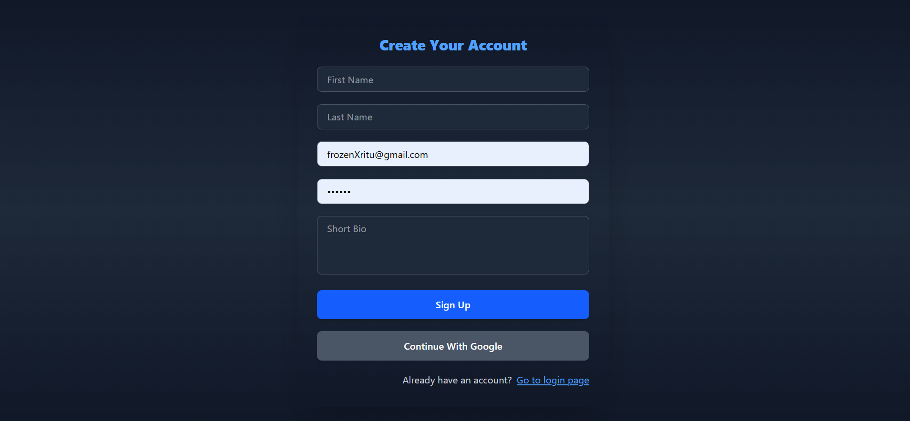
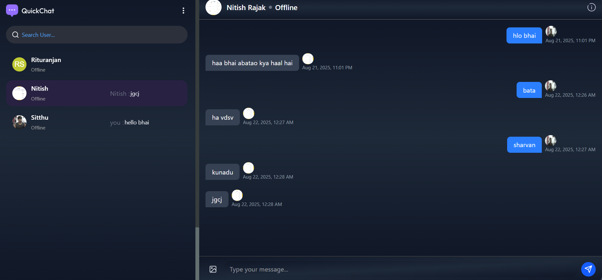
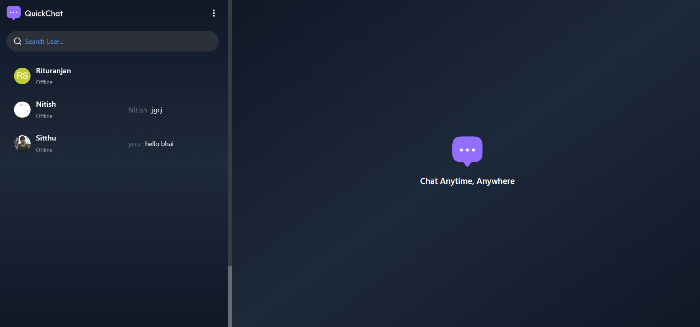
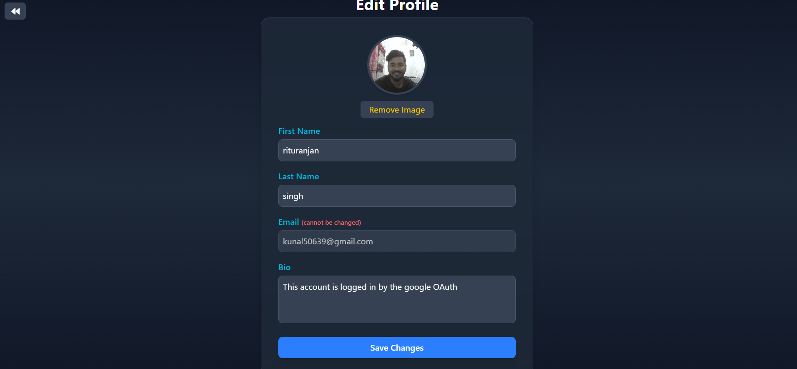

# QuickChat 💬

QuickChat is a **real-time one-to-one chat application** built with **React, Node.js, Express, MongoDB, and Socket.IO**.  
It supports **Google OAuth login/signup**, **seen/unseen message indicators**, and provides a seamless chat experience with modern UI.

---

## 🚀 Features

- 🔒 **Login / Signup with Google OAuth**
- 💬 **One-to-One Real-Time Chat** using Socket.IO
- 👀 **Seen / Unseen Message Indicators**
- 👤 **User Authentication & Profile**
- 📡 **Persistent Rooms & Messages**
- 🎨 **Modern UI with TailwindCSS**
- 🖼 **Responsive Design** for mobile & desktop

---

## 📸 Screenshots

### 🔐 Login with Google  


### 💬 Chat Window  


### 📑 Chat List  


### 📝 Edit Profile  


---

## 🛠 Tech Stack

**Frontend**  
- React.js + Vite  
- TailwindCSS  
- Redux (for state management)  

**Backend**  
- Node.js + Express  
- MongoDB + Mongoose  
- Socket.IO (real-time communication)  
- Google OAuth2 (authentication)  

---

## ⚙️ Installation & Setup

### 1️⃣ Clone the Repository
```bash
git clone https://github.com/rituranjankumar/ChattApp.git
cd ChattApp
```

### 2️⃣ Install Dependencies
```bash
# Root setup (with concurrently)
npm install

# Install frontend & backend separately if needed
cd client && npm install
cd ../server && npm install
```

### 3️⃣ Environment Variables
Create `.env` files in **server** & **client** directories (example provided in `.env.example`).

**Server .env**
```
PORT=7000
MONGO_URI=your_mongodb_uri
JWT_SECRET=your_jwt_secret
GOOGLE_CLIENT_ID=your_google_client_id
GOOGLE_CLIENT_SECRET=your_google_client_secret
```

**Client .env**
```
VITE_GOOGLE_CLIENT_ID=your_google_client_id
VITE_API_URL=http://localhost:7000
```

⚠️ `.env` and `node_modules` are ignored using `.gitignore`.  

### 4️⃣ Run in Development
```bash
npm run dev
```

This runs both frontend & backend together with **concurrently**.

### 5️⃣ Build for Production
```bash
# Inside client
npm run build
```

---

## 🌐 Deployment

### 🚀 Deploy on **Render** (Backend)
1. Push code to GitHub.
2. Create a new **Web Service** on [Render](https://render.com).
3. Connect repo → select backend folder.
4. Add environment variables from `.env`.
5. Deploy 🎉

### 🚀 Deploy on **Vercel** (Frontend)
1. Push code to GitHub.
2. Import repo into [Vercel](https://vercel.com).
3. Set root directory → `client`.
4. Add environment variables (`VITE_API_URL`, `VITE_GOOGLE_CLIENT_ID`).
5. Deploy 🎉

---

## 🤝 Contributing
Pull requests are welcome!  
For major changes, open an issue first to discuss.  

---

## 📜 License
This project is licensed under the MIT License.

---

## 🧑‍💻 Author

**Rituranjan Kumar**  

📧 kunal50639@gmail.com
